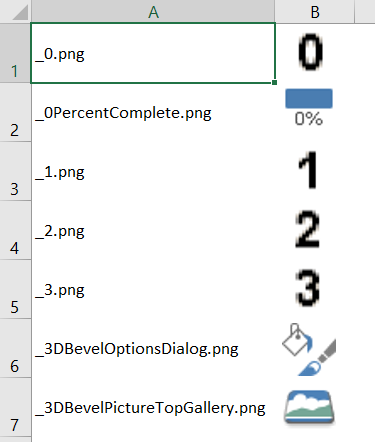

# VBA - Excel - Insert images

>Quickly scan a folder on the hard disk for images and insert them into a worksheet

## Table of Contents

- [Description](#description)
- [Install](#install)
- [Usage](#usage)
- [Author](#author)
- [License](#license)

## Description

Quickly scan a folder on the hard disk for images.

Create a new worksheet and insert images one by one, one image by row.

I've create this macro to import all images that can be used in Excel ribbons to be able to see them in one interface and allow to search on part of their names.

*The VBA should probably be modified to fit your needs.*

### Excel 2013 Icons for use in ribbons

The file [Office_2013_Icon_Gallery_Files.xlsx](files/Office_2013_Icon_Gallery_Files.xlsx) has been generated by this tool.

## Install

Just get a copy of the `image_gallery.xslm` file.

## Usage

Open the workbook and specify the path of the folder where you've your images in the sheet called `Params`.

Be sure the folder exists and contains images with `jpg`, `jpeg` or `png` extensions (otherwise you'll need to adjust the VBA code).

Then, click on the `Insert images` button.

A new worksheet will be created in the workbook and images will be inserted in the worksheet, one image by row.

## Author

Christophe Avonture

## Contribute

PRs not accepted.

## License

[MIT](LICENSE)
